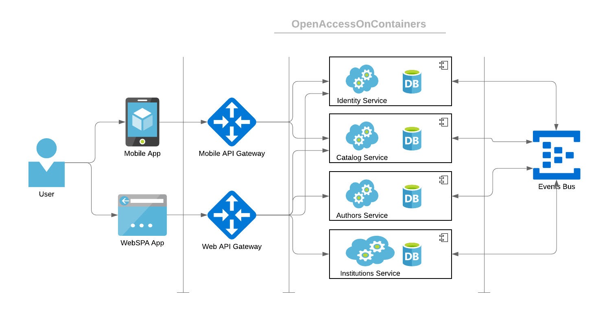

# openAccessOnContainers

I've started this application as part of my Microservices training. It's planned as covering all topics in microservices, including frontend, backend, virtualization, orchestration.

The main idea of the application is harvesting Open Access Repositories of Academic Publications. With this app, researchers will be able to search in many repositories from single access point. They will also be able to organize their researchs in this app.

The project is at an early stage. So, it is not suitable yet for collaboration. I will consider this topic after a while.

## Technical Requirements
- Each microservice and app should have its own repository.
- Each microservice and app should be able to be developed alone.
- Each microservice and app should be able to be live tested alone.
- Integration should be made by environment configuration files.
- All rest api (client or server) submodules should get api definition from main(this) module.
- Developers are responsible for apps. Not backend, not frontend, not db etc.
- After first release, app should be able to be deployed on Azure.

Simplified Diagram of the App Architecture. Orchestration, Containers and Azure details are not included yet.

## How to Run the Application

### Prerequsities
1. Docker should be installed.
2. Nodejs should be installed.
3. Git Bash or any terminal that supports Docker and be able to run sh files should be present.
4. Recommended ide is vscode.

### Steps
1. Clone the master branch with <code>--recursive</code> flag to wherever you want.
2. Switch to the location where you cloned the master branch on your terminal.
3. Duplicate the .env file in the root directory, and rename it to .env.local
4. Uncomment single '#' included lines in .env.local (if you are using vscode, simply select all lines and toggle line comment)
5. To start the application, run this command: <code>./start.sh</code> on your terminal.
7. To stop the application, run this command: <code>./stop.sh</code>

---

More info can be found at: [Project Wiki Pages](https://github.com/huseyindeniz/openAccessOnContainers/wiki)